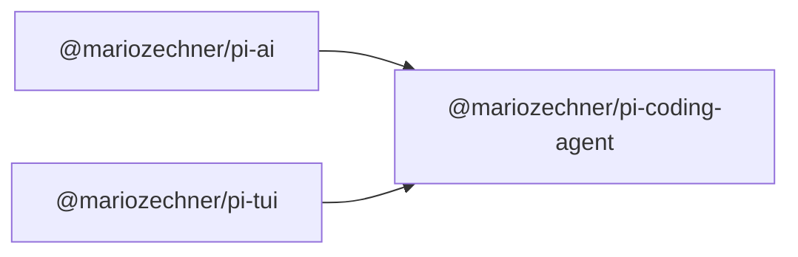

## Monorepo Dependency Graph



---

# Pi Monorepo

> **Looking for the pi coding agent?** See **[packages/coding-agent](packages/coding-agent)** for installation and usage.

Tools for building AI agents.

## Packages

| Package                                | Description                                                      |
| -------------------------------------- | ---------------------------------------------------------------- |
| **[@mariozechner/pi-ai](packages/ai)** | Unified multi-provider LLM API (OpenAI, Anthropic, Google, etc.) |


## Development

```bash
npm install          # Install all dependencies
npm run build        # Build all packages
npm run check        # Type check
bash ./scripts/test.sh            # Run tests (skips LLM-dependent tests without API keys)
bash ./scripts/pi-test.sh         # Run pi from sources (must be run from repo root)
```

> **Note:** `npm run check` requires `npm run build` to be run first.

## License

MIT
